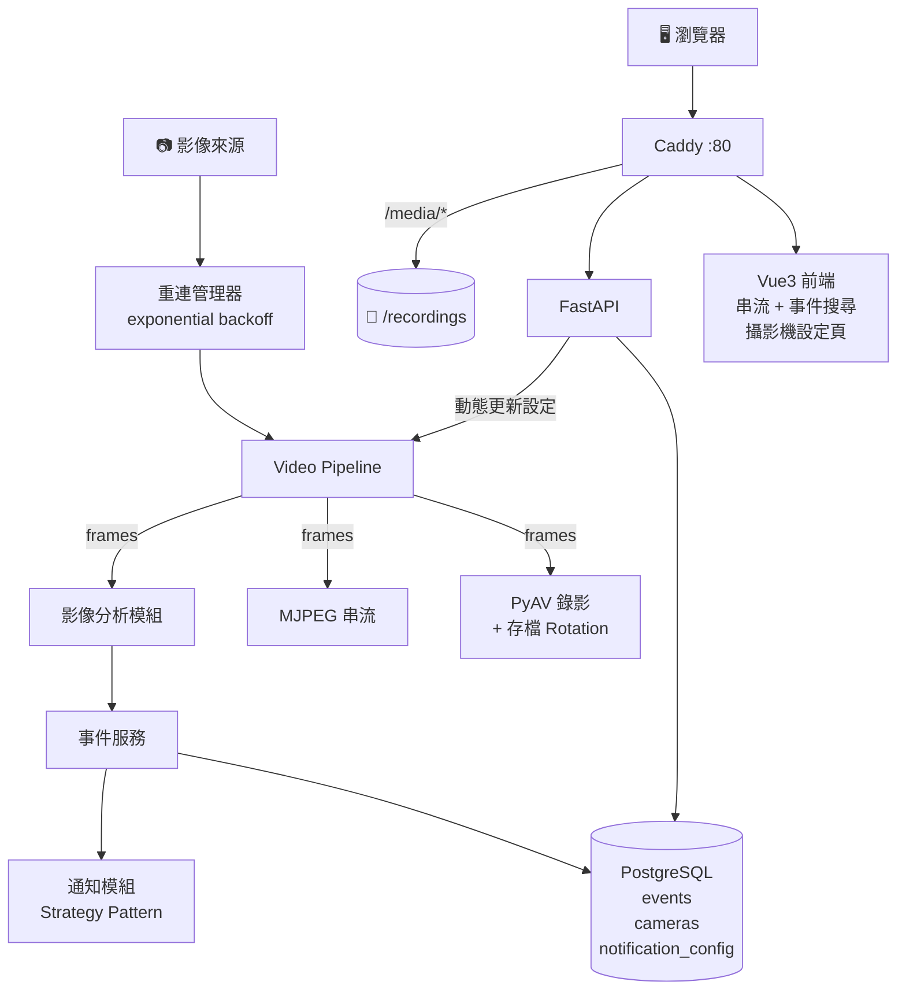

## 系統架構

### 階段 1 (POC，MJPEG 即時串流 + Vue3 前端 + 容器化)

可完整執行的 POC，可從瀏覽器查看即時影像、控制錄影開關，並全容器化部署。

功能：
- MJPEG 串流
- FastAPI 控制 API (開始/結束錄影)
- Vue3 前端 (即時畫面顯示 + 錄影開關)
- Docker compose (Caddy + FastAPI + DB)

### 階段 2 (基礎影像通知 + 事件系統 + 通知系統)

加入無 AI 的影像分析，偵測異常觸發事件錄影，並透過 Telegram / Discord 發出通知。

功能：
- 基礎影像分析 (opencv)
- 事件錄影 (事件前後 10 秒)
- 前端及時事件列表 (WebSocket 通知 + 聲音)
- Telegram Bot / Discord Webhook 通知

### 階段 3 (事件搜尋 + 攝影機設定管理 + 重試機制)

系統功能完整化，具備生產環境基礎素質：可搜尋事件、管理攝影機設定、影像源自動重連。

功能：
- 事件搜尋與篩選（時間範圍、事件類型、攝影機）
- 攝影機設定 CRUD API（camera_id、URL、分析參數）
- 影像來源中斷自動重試（exponential backoff）
- 前端設定頁面（攝影機管理 + 通知開關）
- 錄影存檔 rotation（超過磁碟上限自動刪除最舊檔案）

### 階段 4 (AI 分析 + 多攝影機 + WebRTC)

引入 AI 影像分析，支援多攝影機 (前端多格顯示)，加入 WebRTC 串流。

功能：
- AI 影像分析 + 影像處理 (e.g. 加遮罩)
- 多攝影機同時運作（前端多格 Grid 顯示）
- WebRTC 串流

### 架構圖

## 使用到的技術

### 後端
- FastAPI
- 串流
  - MJPEG
  - WebRTC
- 影像分析
  - OpenCV
- 錄影
  - PyAV
  - ffmpeg
- 通知系統
  - Telegram
  - DC webhook

### 前端
- Vue3 + TS

### 資料庫
- SQLAlchemy
- Alembic
- PostgreSQL

### 部屬
- Docker
- Caddy
