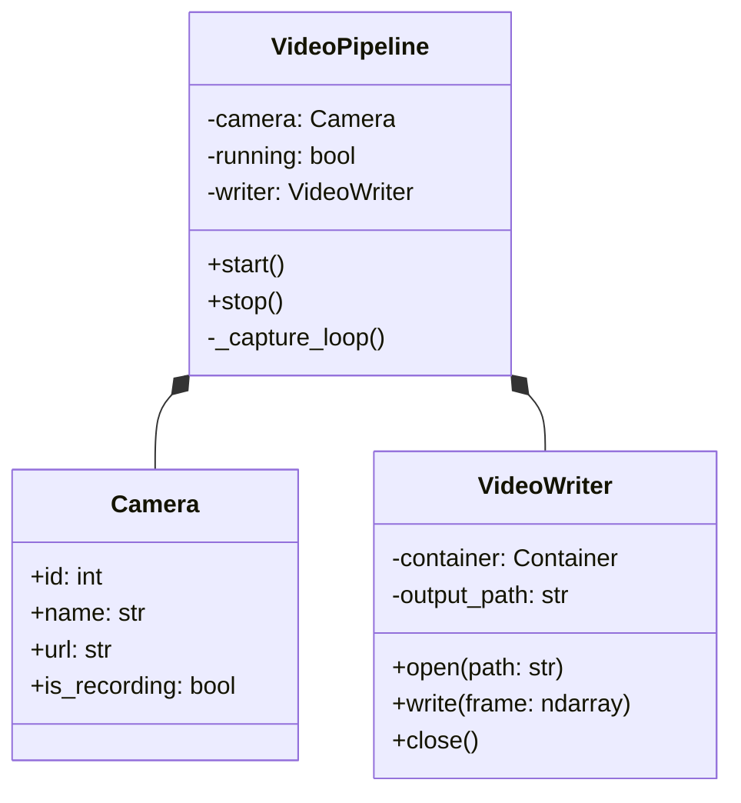
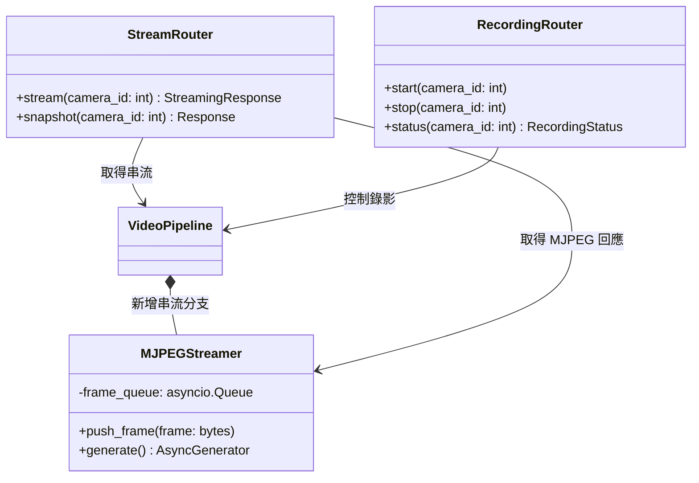
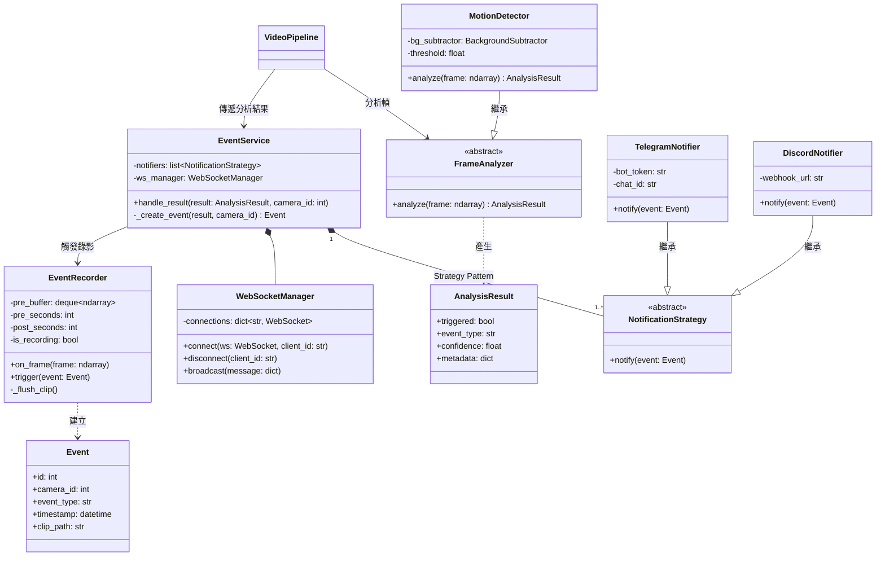
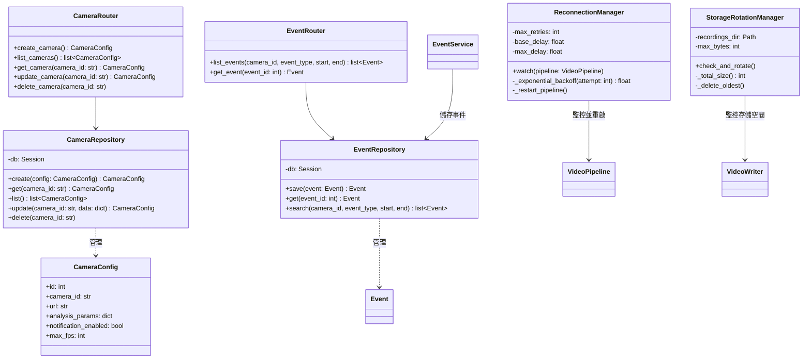
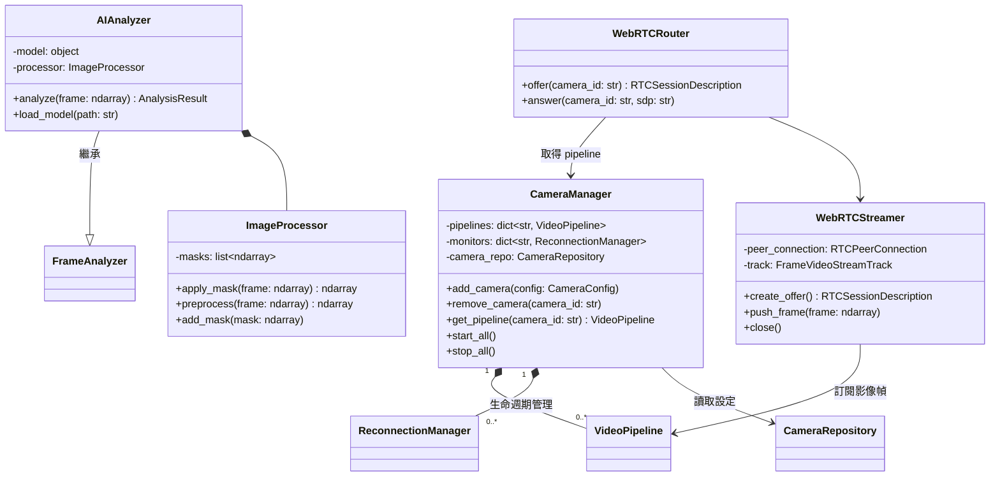

# 後端系統物件導向設計 (OOA/OOD)

各階段採用**增量設計**，每階段僅列出**新增**的類別，最後提供完整系統類別圖。

---

## Phase 1：Core（後端基礎錄影管線）

> 核心職責：從攝影機讀取影像幀並持續分段錄影，作為後續所有功能的基礎。無前端介面、無串流，僅透過 `.env` 設定影像來源。

**設計說明：**
- `VideoPipeline` 是核心協調者，持有 `Camera` 資訊，於擷取迴圈中將影像幀寫入 `VideoWriter`。
- `VideoWriter` 封裝 PyAV 的開檔、寫幀、關檔操作，並負責分段 mp4 輸出。

---

## Phase 2：POC（MJPEG 串流 + 錄影控制 + 前端）

> 核心職責：在 Phase 1 的錄影管線上，加入 MJPEG 即時串流與 FastAPI 控制介面，搭配 Vue3 前端與容器化部署。

**設計說明：**
- `VideoPipeline` 於本階段新增 `MJPEGStreamer` 分支，將影像幀同時分發給串流與錄影模組。
- `MJPEGStreamer` 使用非同步佇列，使 HTTP streaming response 不阻塞主執行緒。
- `StreamRouter` / `RecordingRouter` 提供串流與錄影開關的 FastAPI 控制介面，供 Vue3 前端呼叫。

---

## Phase 3：影像分析 + 事件系統 + 通知系統

> 核心職責：對影像幀進行分析，偵測異常後建立事件、觸發事件錄影，並透過多管道發送通知，同時推播至前端。

**設計說明：**
- `FrameAnalyzer` 為抽象類別，採用 **Template Method**，Phase 5 的 AI 分析器只需繼承並實作 `analyze()`。
- `NotificationStrategy` 採用 **Strategy Pattern**，可動態增減通知管道。
- `EventRecorder` 維護一個滾動的前置緩衝區（deque），事件觸發後補錄後置片段，再合併輸出完整短片。
- `EventService` 作為**門面（Facade）**，協調事件建立、通知發送、WebSocket 推播。

---

## Phase 4：MVP（事件搜尋 + 攝影機設定管理 + 重試機制）

> 核心職責：系統化管理攝影機設定與事件資料，提供搜尋 API，並以 exponential backoff 應對影像源中斷。

**設計說明：**
- `CameraRepository` 與 `EventRepository` 遵循 **Repository Pattern**，隔離資料存取邏輯。
- `ReconnectionManager` 使用 **exponential backoff**：延遲 = `min(base_delay * 2^attempt, max_delay)`。
- `StorageRotationManager` 週期性檢查目錄總大小，超過上限則刪除最舊的錄影檔。

---

## Phase 5：AI 分析 + 多攝影機 + WebRTC

> 核心職責：以 AI 模型強化分析能力，統一管理多路攝影機生命週期，並提供 WebRTC 低延遲串流。

**設計說明：**
- `AIAnalyzer` 繼承 `FrameAnalyzer`，無縫替換或並行 `MotionDetector`，不影響 `EventService`。
- `CameraManager` 採用 **Facade Pattern**，統一管理多攝影機的啟停、重連、Pipeline 查詢，供 Router 層呼叫。
- `WebRTCStreamer` 作為 **Adapter**，將內部的 ndarray 幀轉換為 aiortc 所需的 `VideoStreamTrack`。

---

## 完整系統類別圖（Phase 5 累積）

```mermaid
classDiagram
    %% ── 資料模型 ──
    class Camera {
        +id: int
        +name: str
        +url: str
        +is_recording: bool
    }
    class CameraConfig {
        +id: int
        +camera_id: str
        +url: str
        +analysis_params: dict
        +notification_enabled: bool
    }
    class Event {
        +id: int
        +camera_id: int
        +event_type: str
        +timestamp: datetime
        +clip_path: str
    }
    class AnalysisResult {
        +triggered: bool
        +event_type: str
        +confidence: float
        +metadata: dict
    }

    %% ── 影像管線 ──
    class VideoPipeline {
        -camera: Camera
        -running: bool
        +start()
        +stop()
        -_capture_loop()
    }
    class MJPEGStreamer {
        +push_frame(frame: bytes)
        +generate() AsyncGenerator
    }
    class WebRTCStreamer {
        +create_offer() RTCSessionDescription
        +push_frame(frame: ndarray)
    }
    class VideoWriter {
        +open(path: str)
        +write(frame: ndarray)
        +close()
    }

    %% ── 分析模組 ──
    class FrameAnalyzer {
        <<abstract>>
        +analyze(frame: ndarray) AnalysisResult
    }
    class MotionDetector {
        +analyze(frame: ndarray) AnalysisResult
    }
    class AIAnalyzer {
        +analyze(frame: ndarray) AnalysisResult
        +load_model(path: str)
    }
    class ImageProcessor {
        +apply_mask(frame: ndarray) ndarray
        +preprocess(frame: ndarray) ndarray
    }

    %% ── 事件與通知 ──
    class EventRecorder {
        +on_frame(frame: ndarray)
        +trigger(event: Event)
    }
    class EventService {
        +handle_result(result: AnalysisResult, camera_id: int)
    }
    class NotificationStrategy {
        <<abstract>>
        +notify(event: Event)
    }
    class TelegramNotifier {
        +notify(event: Event)
    }
    class DiscordNotifier {
        +notify(event: Event)
    }
    class WebSocketManager {
        +connect(ws: WebSocket, client_id: str)
        +disconnect(client_id: str)
        +broadcast(message: dict)
    }

    %% ── 儲存庫 ──
    class CameraRepository {
        +create(config) CameraConfig
        +get(camera_id) CameraConfig
        +update(camera_id, data) CameraConfig
        +delete(camera_id)
    }
    class EventRepository {
        +save(event) Event
        +search(camera_id, event_type, start, end) list~Event~
    }
    class StorageRotationManager {
        +check_and_rotate()
    }

    %% ── 基礎設施 ──
    class ReconnectionManager {
        +watch(pipeline: VideoPipeline)
        -_exponential_backoff(attempt) float
    }
    class CameraManager {
        +add_camera(config: CameraConfig)
        +remove_camera(camera_id: str)
        +get_pipeline(camera_id: str) VideoPipeline
    }

    %% ── 關係 ──
    MotionDetector --|> FrameAnalyzer
    AIAnalyzer --|> FrameAnalyzer
    TelegramNotifier --|> NotificationStrategy
    DiscordNotifier --|> NotificationStrategy

    VideoPipeline *-- Camera
    VideoPipeline --> MJPEGStreamer
    VideoPipeline --> VideoWriter
    VideoPipeline --> FrameAnalyzer
    VideoPipeline --> EventService

    AIAnalyzer *-- ImageProcessor
    FrameAnalyzer ..> AnalysisResult

    EventService *-- NotificationStrategy
    EventService *-- WebSocketManager
    EventService --> EventRecorder
    EventService --> EventRepository
    EventRecorder ..> Event

    CameraManager *-- VideoPipeline
    CameraManager *-- ReconnectionManager
    CameraManager --> CameraRepository

    WebRTCStreamer --> VideoPipeline
    StorageRotationManager --> VideoWriter
```

