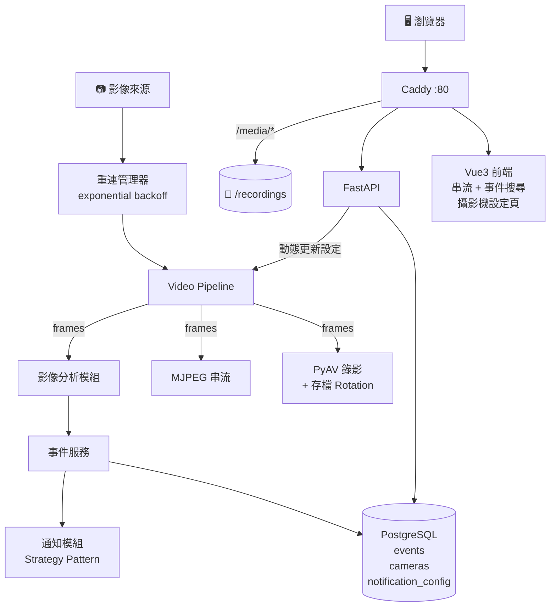

# 提案報告書

**專案執行者**：上竣

**諮詢講師**：＿＿＿＿＿＿＿＿

---

## 1. 我的專案主題

以 FastAPI + Python 復刻簡化版開源 NVR 系統（參考 Frigate），實現即時影像串流、自動錄影、影像分析與事件通知的完整後端平台，並搭配 Vue3 前端與 Docker 容器化部署。

---

## 2. 我的專案目標

### 2-1 製作專案的原因（50-100字）

希望打造一個具備一定複雜度的 Python 專案，作為展示後端系統設計與基礎前端能力的作品集。目前任職公司有開發類似的影像監控產品，系統架構更為複雜，本專案擷取其核心概念並自行實作，驗證自身的系統設計理解。影像分析部分僅採用現成 AI 模型（YOLO），不涉及模型訓練或調整，專注於後端工程整合能力的呈現。

### 2-2 想達成的專案成果目標

- 接案
- 純創作
- ✅ 作品集／履歷（主要目標）
- ✅ 技術能力驗證（次要目標）

---

## 3. 資料搜集（靈感、參考、過往經驗）

**3-1 靈感來源**

- 參考開源專案 [Frigate NVR](https://frigate.video/)，了解生產級 NVR 系統的功能規格與架構設計

**3-2 技術參考**

- FastAPI 官方文件（API 框架）
- OpenCV-Python 文件（影像分析）
- PyAV 文件（影像編碼錄影）
- aiortc 文件（WebRTC 串流）
- SQLAlchemy 2.0 async 文件（ORM）

**3-3 過往經驗**

- 4 年以上 FastAPI 後端 + Vue3 前端開發經驗
- 熟悉 Python asyncio 非同步程式設計
- Docker Compose 容器化部署經驗
- PostgreSQL 資料庫設計與操作
- GCP 雲端部屬

---

## 4. 專案執行規劃

### 4-1 專案名稱定錨

**專案名稱：FastAPI-NVR**

以 FastAPI 打造的輕量 NVR（Network Video Recorder）後端系統，聚焦後端系統設計的作品集展示。

### 4-2 專案使用技術

**後端**

| 技術 | 用途 |
|---|---|
| Python 3.12+ | 主要語言 |
| FastAPI | HTTP API + MJPEG 串流端點 + WebSocket |
| asyncio + ThreadPoolExecutor | 非同步影像擷取（cv2 為同步，包在 executor 中執行） |
| OpenCV-Python (cv2) | 影像擷取、基礎影像分析（MOG2 背景相減） |
| PyAV | 影像編碼與錄影寫入（H.264 mp4） |
| SQLAlchemy 2.0 (async) | ORM |
| Alembic | 資料庫 Migration |
| Pydantic v2 | 資料驗證與設定管理 |
| httpx | 對外 HTTP 請求（通知 API） |
| aiortc | WebRTC 串流（Phase 5） |
| YOLO | AI 物件偵測（Phase 5） |

**前端**

| 技術 | 用途 |
|---|---|
| Vue 3 | 前端框架 |
| Vuetify 4 | UI 元件庫 |
| Pinia | 狀態管理 |
| Vue Router | 路由（History Mode） |

**資料庫**

| 技術 | 用途 |
|---|---|
| PostgreSQL 18 | 事件紀錄、攝影機設定、通知設定 |

**基礎架構**

| 技術 | 用途 |
|---|---|
| Docker + Docker Compose | 容器化部署 |
| Caddy | 反向代理 + 靜態檔伺服器 + 影片直讀 |
| ffmpeg（via PyAV） | 底層影像編解碼 |

**通知系統**

| 技術 | 說明 |
|---|---|
| Telegram Bot API | 事件通知推播 |
| Discord Webhook | 事件通知推播 |
| WebSocket | 前端即時事件推播 |

> 通知模組採 **Strategy Pattern** 設計，新增通知管道只需新增一個 class，不改動核心邏輯。

### 4-3 系統架構圖

### 4-4 專案時間規劃

| 專案執行時程 | 專案執行目標 | 完成狀況 |
|---|---|---|
| 06/01–06/07 | Phase 1：後端基礎錄影管線（webcam/RTSP 擷取、PyAV 分段錄影） | 尚未開始 |
| 06/08–06/21 | Phase 2：MJPEG 即時串流 + FastAPI 控制 API + PostgreSQL schema 建立 | 尚未開始 |
| 06/22–06/28 | Phase 2：Vue3 前端（串流顯示 + 錄影開關）+ Docker Compose 容器化 | 尚未開始 |
| 06/29–07/12 | Phase 3：基礎影像分析（OpenCV MOG2）+ 事件錄影（pre-event ring buffer） | 尚未開始 |
| 07/13–07/19 | Phase 3：Telegram / Discord 通知系統 + 前端 WebSocket 即時事件警示 | 尚未開始 |
| 07/20–08/02 | Phase 4：事件搜尋與篩選 API + 攝影機設定 CRUD | 尚未開始 |
| 08/03–08/09 | Phase 4：自動重連（exponential backoff）+ 存檔 Rotation + 前端設定頁 | 尚未開始 |
| 08/10–08/30 | Phase 5：YOLO AI 物件偵測 + 多攝影機同時運作（前端 Grid 顯示） | 尚未開始 |
| 08/31–09/13 | Phase 5：WebRTC 串流（aiortc）+ AI 事件標籤搜尋 | 尚未開始 |
| 09/14–09/20 | 整合測試、效能調整、文件完善、作品集發布 | 尚未開始 |

